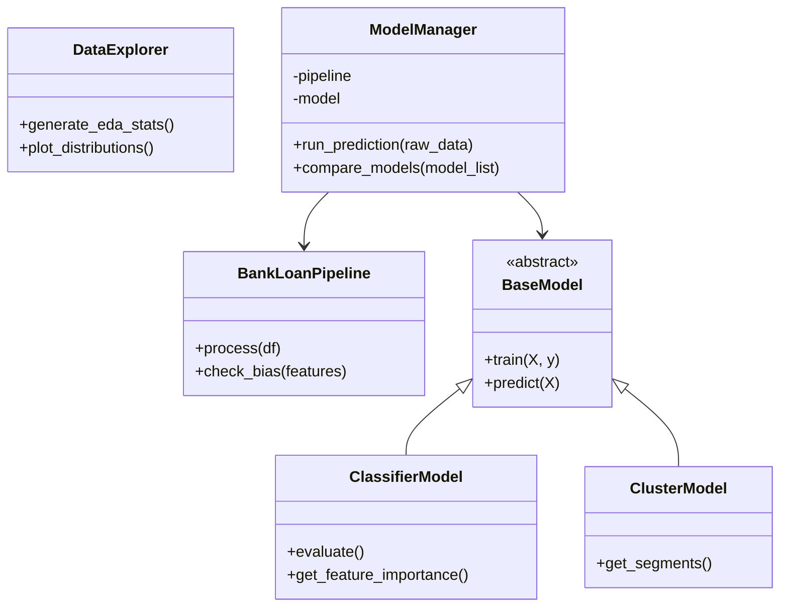

# Análise de Crédito

## 🎯 Objetivos e Principais Features
Este projeto se propõe a desenvolver um modelo de análise de risco para prever a probabilidade de inadimplência, auxiliando bancos e outras instituições financeiras na redução de perdas durante suas políticas de concessão de crédito a clientes. O foco central, portanto, é determinar a confiabilidade de usuários bancários por meio da identificação de padrões e fatores determinantes para o não pagamento de débitos.
Nesse sentido, a principal hipótese investigada é se variáveis como altos níveis de endividamento, baixa renda e histórico negativo possuem correlação direta e estatisticamente relevante com o risco de calote por parte de usuários bancários. Assim, essa investigação busca gerar, como produto, a automatização da classificação de risco na concessão de crédito com base nos perfis dos clientes, proporcionando insights estratégicos para decisões mais assertivas e seguras por parte de agências do setor financeiro.

As principais features (variáveis) a serem exploradas são:
- Dados socioeconômicos: Análise de como fatores como experiência profissional, escolaridade, renda anual, taxa de endividamento e a relação crédito/dívida impactam a probabilidade de calote.
- Dados demográficos: Mensuração de como a geolocalização dos clientes se relaciona com o histórico de inadimplência e sua relevância para a classificação de riscos futuros.
- Dados históricos: Verificação da importância do comportamento financeiro passado de cada cliente como preditor plausível de suas ações futuras.

### 📊 Dataset Escolhido
* **Origem:** [Credit Risk Analysis for extending Bank Loans (Kaggle)](https://www.kaggle.com/datasets/atulmittal199174/credit-risk-analysis-for-extending-bank-loans)
* **Tamanho:** 1.150 instâncias / 42,07kB
* **Quantidade de Features:** 9 variáveis, incluindo dados socioeconômicos, demográficos e histórico financeiro, a saber: *age* (idade), *ed* (escolaridade), *employ* (experiência profissional), *address* (endereço), *income* (renda), *debtinc* (índice de endividamento), *creddebt* (relação crédito/dívida), *othdebt* (outras dívidas) e *default* (variável binária, indicando se o cliente já foi inadimplente no passado).

### Diagramas UML 

## De Classes (Estático)

## 👥 Membros da Equipe e Papéis
* **[Anny Caroline Almida Marcelino](https://github.com/AnnyACAM)**
  * **Papel:** *Machine Learning Engineer / Cientista de Dados*
  * **Responsabilidades:** Lidera a inteligência preditiva. Responsável pela seleção de algoritmos, divisão de dados (treino/teste), ajuste de hiperparâmetros e validação do modelo através de métricas como Acurácia, F1-Score e AUC-ROC.

* **[Carolina Penido Barcellos](https://github.com/carolinabarcellos)**
  * **Papel:** *Analista de Dados / Data Storyteller*
  * **Responsabilidades:** Atua na ponte entre dados e decisão. Responsável pela criação de visualizações críticas, interpretação estatística dos resultados e tradução dos outputs do modelo em insights estratégicos de negócio.

* **[Gabrielly Xavier dos Santos](https://github.com/gabyxsantos)**
  * **Papel:** *Cientista de Dados / Analista Exploratória*
  * **Responsabilidades:** Focada na compreensão e preparação. Realiza a Análise Exploratória de Dados (EDA) para identificar correlações, trata *outliers* e conduz a Engenharia de Atributos (*Feature Engineering*).

* **[Matheus Soares dos Santos de Freitas](https://github.com/Doctor-Math)**
  * **Papel:** *Engenheiro de Dados / Arquiteto de Dados*
  * **Responsabilidades:** Garante a infraestrutura e qualidade. Responsável pelo pipeline de limpeza, tratamento de valores nulos (NaN), garantia da tipagem correta e estruturação do dataset final para processamento.

## 🛠️ Pilha de Tecnologias

### 💻 Ambiente e Hardware
- **Plataforma:** Google Colab
- **Aceleração de Hardware:** CPU e GPU (NVIDIA T4) para processamento paralelo, conforme necessidade.
- **Memória RAM:** Instância padrão de ~12GB.

### 🐍 Linguagem e Dependências
- **Linguagem:** Python 3.10.12

| Ferramenta | Versão | Função Principal |
| :--- | :--- | :--- |
| **Pandas** | 2.2.2 | Manipulação, limpeza e análise de dados estruturados. |
| **NumPy** | 2.0.2 | Computação numérica e operações com arrays multidimensionais. |
| **Scikit-learn** | 1.6.1 | Modelagem preditiva, pré-processamento e métricas de avaliação. |
| **Matplotlib** | 3.10.0 | Geração de gráficos e customização de visualizações base. |
| **Seaborn** | 0.13.2 | Interface de alto nível para gráficos estatísticos informativos. |
